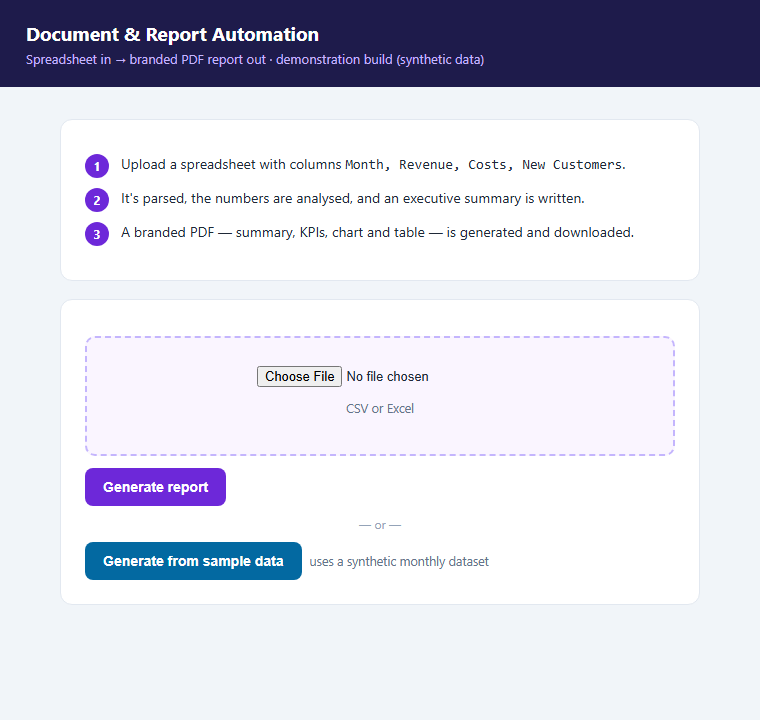
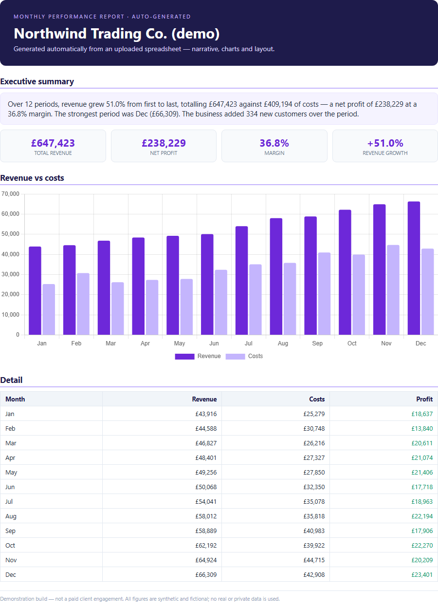

# Document & Report Automation

Upload a spreadsheet → get a **branded, print-ready PDF report** in seconds: parsed figures,
an auto-written executive summary, a chart, and a formatted table. Built as a portfolio
demonstration of document/data automation.


## Screenshots
| Upload UI | Generated PDF report |
|---|---|
|  |  |

## What it does
1. **Reads** an uploaded spreadsheet (CSV or Excel) — columns `Month, Revenue, Costs, New Customers`.
2. **Analyses** the figures — totals, profit, margin, first→last growth, best period.
3. **Writes** a concise executive summary (rule-based, or Claude-written if enabled).
4. **Builds** a branded report — cover, KPI cards, revenue-vs-costs chart, detail table.
5. **Renders** it to a high-resolution PDF via the headless-Chrome render pipeline.

## Run it locally
```bash
pip install -r requirements.txt
uvicorn app.main:app --reload --port 8011
# open http://localhost:8011  →  upload a sheet, or click "Generate from sample data"
```

## How the pieces fit
| File | Role |
|---|---|
| `app/report.py`  | parse → compute metrics → narrative → build branded HTML |
| `app/render.py`  | HTML → PDF via headless Chrome (auto-detects Chrome, or `CHROME_PATH`) |
| `app/main.py`    | FastAPI upload UI + `/generate` and `/generate-sample` endpoints |
| `app/sample_data.py` | generates a synthetic monthly dataset for the demo |

## Optional: Claude-written summary
```bash
pip install anthropic
export ANTHROPIC_API_KEY=sk-ant-...
# then set use_llm=True where narrative() is called in app/main.py
```

## Data & privacy
The demo runs on **synthetic figures for a fictional company** — no real financials,
personal data, or private information. Uploaded files are parsed in a temp location and
deleted immediately after the report is generated.

## Stack
Python · FastAPI · pandas / openpyxl · Chart.js · headless-Chrome PDF render · (optional) Claude.

---
*Demonstration build — not a paid client engagement. All figures shown are synthetic.*
